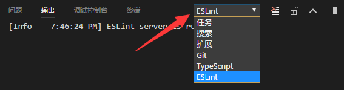

# TypeScript 入门教程


从 JavaScript 程序员的角度总结思考，循序渐进的理解 TypeScript。

## 关于本书

- [在线阅读](https://ts.xcatliu.com/)（部署在 [GitBook](https://www.gitbook.com/book/xcatliu/typescript-tutorial/details) 上，可能需要翻墙）
- [在线阅读（GitHub 版）](https://github.com/xcatliu/typescript-tutorial/blob/master/README.md)
- [GitHub 地址][GitHub]
- 作者：[xcatliu](https://github.com/xcatliu/)
- 官方 QQ 群：[加入 QQ 群 767142358](https://jq.qq.com/?_wv=1027&k=5nkkFCl)

本书是作者在学习 [TypeScript] 后整理的学习笔记。

随着对 TypeScript 理解的加深和 TypeScript 社区的发展，本书也会做出相应的更新，欢迎大家 [Star 收藏][GitHub]。

- 发现文章内容有问题，可以直接在页面下方评论
- 对项目的建议，可以[提交 issue](https://github.com/xcatliu/typescript-tutorial/issues/new) 向作者反馈
- 欢迎直接提交 pull-request 参与贡献

## 为什么要写本书

TypeScript 虽然有[官方手册][Handbook]及其[非官方中文版][中文手册]，但是它每一章都希望能详尽的描述一个概念，导致前面的章节就会包含很多后面才会学习到的内容，而有些本该一开始就了解的基础知识却在后面才会涉及。如果是初学者，可能需要阅读多次才能理解。所以它更适合用来查阅，而不是学习。

与官方手册不同，本书着重于从 JavaScript 程序员的角度总结思考，循序渐进的理解 TypeScript，希望能给大家一些帮助和启示。

由于一些知识点与官方手册重合度很高，本书会在相应章节推荐直接阅读中文手册。

## 关于 TypeScript

[TypeScript] 是 JavaScript 的一个超集，主要提供了**类型系统**和**对 ES6 的支持**，它由 Microsoft 开发，代码[开源于 GitHub](https://github.com/Microsoft/TypeScript) 上。

它的第一个版本发布于 2012 年 10 月，经历了多次更新后，现在已成为前端社区中不可忽视的力量，不仅在 Microsoft 内部得到广泛运用，而且 Google 的 [Angular2](https://angular.io/) 也使用了 TypeScript 作为开发语言。

## 适合人群

本书适合以下人群

- 熟悉 JavaScript，至少阅读过一遍[《JavaScript 高级程序设计》](https://book.douban.com/subject/10546125/)
- 了解 ES6，推荐阅读 [ECMAScript 6 入门]
- 了解 Node.js，会用 npm 安装及使用一些工具
- 想了解 TypeScript 或者想对 TypeScript 有更深的理解

本书**不适合**以下人群

- 没有系统学习过 JavaScript
- 已经能够很熟练的运用 TypeScript

## 评价

> 《TypeScript 入门教程》全面介绍了 TS 强大的类型系统，完整而简洁，示例丰富，比官方文档更易读，非常适合作为初学者学习 TS 的第一本书。
>
> —— [阮一峰](https://github.com/ruanyf)

## 目录

- [前言](README.md)
- [简介](introduction/README.md)
  - [什么是 TypeScript](introduction/what-is-typescript.md)
  - [安装 TypeScript](introduction/get-typescript.md)
  - [Hello TypeScript](introduction/hello-typescript.md)
- [基础](basics/README.md)
  - [原始数据类型](basics/primitive-data-types.md)
  - [任意值](basics/any.md)
  - [类型推论](basics/type-inference.md)
  - [联合类型](basics/union-types.md)
  - [对象的类型——接口](basics/type-of-object-interfaces.md)
  - [数组的类型](basics/type-of-array.md)
  - [函数的类型](basics/type-of-function.md)
  - [类型断言](basics/type-assertion.md)
  - [声明文件](basics/declaration-files.md)
  - [内置对象](basics/built-in-objects.md)
- [进阶](advanced/README.md)
  - [类型别名](advanced/type-aliases.md)
  - [字符串字面量类型](advanced/string-literal-types.md)
  - [元组](advanced/tuple.md)
  - [枚举](advanced/enum.md)
  - [类](advanced/class.md)
  - [类与接口](advanced/class-and-interfaces.md)
  - [泛型](advanced/generics.md)
  - [声明合并](advanced/declaration-merging.md)
  - [扩展阅读](advanced/further-reading.md)
- [工程](engineering/README.md)
  - [代码检查](engineering/lint.md)
- [感谢](thanks/README.md)

## 版权许可

本书采用「保持署名—非商用」创意共享 4.0 许可证。

只要保持原作者署名和非商用，您可以自由地阅读、分享、修改本书。

详细的法律条文请参见[创意共享](http://creativecommons.org/licenses/by-nc/4.0/)网站。

## 相关资料

- [TypeScript 官网][TypeScript]
- [Handbook]（[中文版][中文手册]）
- [ECMAScript 6 入门]

---

- [下一章：简介](introduction/README.md)

[GitHub]: https://github.com/xcatliu/typescript-tutorial
[TypeScript]: http://www.typescriptlang.org/
[Handbook]: http://www.typescriptlang.org/docs/handbook/basic-types.html
[中文手册]: https://zhongsp.gitbooks.io/typescript-handbook/content/
[ECMAScript 6 入门]: http://es6.ruanyifeng.com/


# 简介

本部分介绍了在学习 TypeScript 之前需要了解的知识，具体内容包括：

- [什么是 TypeScript](what-is-typescript.md)
- [安装 TypeScript](get-typescript.md)
- [Hello TypeScript](hello-typescript.md)

---

- [上一章：前言](../README.md)
- [下一章：什么是 TypeScript](what-is-typescript.md)


# 什么是 TypeScript

首先，我对 TypeScript 的理解如下：

[TypeScript][] 是 JavaScript 的一个超集，主要提供了**类型系统**和**对 ES6 的支持**，它由 Microsoft 开发，代码[开源于 GitHub](https://github.com/Microsoft/TypeScript) 上。

其次引用[官网][TypeScript]的定义：

> TypeScript is a typed superset of JavaScript that compiles to plain JavaScript. Any browser. Any host. Any OS. Open source.

翻译成中文即是：

> TypeScript 是 JavaScript 的类型的超集，它可以编译成纯 JavaScript。编译出来的 JavaScript 可以运行在任何浏览器上。TypeScript 编译工具可以运行在任何服务器和任何系统上。TypeScript 是开源的。

## 为什么选择 TypeScript

[TypeScript 官网][TypeScript]列举了一些优势，不过我更愿意自己总结一下：

### TypeScript 增加了代码的可读性和可维护性

- 类型系统实际上是最好的文档，大部分的函数看看类型的定义就可以知道如何使用了
- 可以在编译阶段就发现大部分错误，这总比在运行时候出错好
- 增强了编辑器和 IDE 的功能，包括代码补全、接口提示、跳转到定义、重构等

### TypeScript 非常包容

- TypeScript 是 JavaScript 的超集，`.js` 文件可以直接重命名为 `.ts` 即可
- 即使不显式的定义类型，也能够自动做出[类型推论](../basics/type-inference.md)
- 可以定义从简单到复杂的几乎一切类型
- 即使 TypeScript 编译报错，也可以生成 JavaScript 文件
- 兼容第三方库，即使第三方库不是用 TypeScript 写的，也可以编写单独的类型文件供 TypeScript 读取

### TypeScript 拥有活跃的社区

- 大部分第三方库都有提供给 TypeScript 的类型定义文件
- Google 开发的 Angular2 就是使用 TypeScript 编写的
- TypeScript 拥抱了 ES6 规范，也支持部分 ESNext 草案的规范

### TypeScript 的缺点

任何事物都是有两面性的，我认为 TypeScript 的弊端在于：

- 有一定的学习成本，需要理解接口（Interfaces）、泛型（Generics）、类（Classes）、枚举类型（Enums）等前端工程师可能不是很熟悉的概念
- 短期可能会增加一些开发成本，毕竟要多写一些类型的定义，不过对于一个需要长期维护的项目，TypeScript 能够减少其维护成本
- 集成到构建流程需要一些工作量
- 可能和一些库结合的不是很完美

大家可以根据自己团队和项目的情况判断是否需要使用 TypeScript。

[TypeScript]: http://www.typescriptlang.org/

---

- [上一章：简介](README.md)
- [下一章：安装 TypeScript](get-typescript.md)


# 安装 TypeScript

TypeScript 的命令行工具安装方法如下：

```bash
npm install -g typescript
```

以上命令会在全局环境下安装 `tsc` 命令，安装完成之后，我们就可以在任何地方执行 `tsc` 命令了。

编译一个 TypeScript 文件很简单：

```bash
tsc hello.ts
```

我们约定使用 TypeScript 编写的文件以 `.ts` 为后缀，用 TypeScript 编写 React 时，以 `.tsx` 为后缀。

## 编辑器

TypeScript 最大的优势便是增强了编辑器和 IDE 的功能，包括代码补全、接口提示、跳转到定义、重构等。

主流的编辑器都支持 TypeScript，这里我推荐使用 [Visual Studio Code](https://code.visualstudio.com/)。

它是一款开源，跨终端的轻量级编辑器，内置了 TypeScript 支持。

另外它本身也是[用 TypeScript 编写的](https://github.com/Microsoft/vscode/)。

下载安装：https://code.visualstudio.com/

获取其他编辑器或 IDE 对 TypeScript 的支持：

- [Sublime Text](https://github.com/Microsoft/TypeScript-Sublime-Plugin)
- [Atom](https://atom.io/packages/atom-typescript)
- [WebStorm](https://www.jetbrains.com/webstorm/)
- [Vim](https://github.com/Microsoft/TypeScript/wiki/TypeScript-Editor-Support#vim)
- [Emacs](https://github.com/ananthakumaran/tide)
- [Eclipse](https://github.com/palantir/eclipse-typescript)
- [Visual Studio 2015](https://www.microsoft.com/en-us/download/details.aspx?id=48593)
- [Visual Studio 2013](https://www.microsoft.com/en-us/download/details.aspx?id=48739)

---

- [上一章：什么是 TypeScript](what-is-typescript.md)
- [下一章：Hello TypeScript](hello-typescript.md)

# Hello TypeScript

我们从一个简单的例子开始。

将以下代码复制到 `hello.ts` 中：

```ts
function sayHello(person: string) {
    return 'Hello, ' + person;
}

let user = 'Tom';
console.log(sayHello(user));
```

然后执行

```bash
tsc hello.ts
```

这时候会生成一个编译好的文件 `hello.js`：

```js
function sayHello(person) {
    return 'Hello, ' + person;
}
var user = 'Tom';
console.log(sayHello(user));
```

TypeScript 中，使用 `:` 指定变量的类型，`:` 的前后有没有空格都可以。

上述例子中，我们用 `:` 指定 `person` 参数类型为 `string`。但是编译为 js 之后，并没有什么检查的代码被插入进来。

**TypeScript 只会进行静态检查，如果发现有错误，编译的时候就会报错。**

> `let` 是 ES6 中的关键字，和 `var` 类似，用于定义一个局部变量，可以参阅 [let 和 const 命令](http://es6.ruanyifeng.com/#docs/let)。

下面尝试把这段代码编译一下：

```ts
function sayHello(person: string) {
    return 'Hello, ' + person;
}

let user = [0, 1, 2];
console.log(sayHello(user));
```

编辑器中会提示错误，编译的时候也会出错：

```bash
index.ts(6,22): error TS2345: Argument of type 'number[]' is not assignable to parameter of type 'string'.
```

但是还是生成了 js 文件：

```js
function sayHello(person) {
    return 'Hello, ' + person;
}
var user = [0, 1, 2];
console.log(sayHello(user));
```

**TypeScript 编译的时候即使报错了，还是会生成编译结果**，我们仍然可以使用这个编译之后的文件。

如果要在报错的时候终止 js 文件的生成，可以在 `tsconfig.json` 中配置 `noEmitOnError` 即可。关于 `tsconfig.json`，请参阅[官方手册](http://www.typescriptlang.org/docs/handbook/tsconfig-json.html)（[中文版](https://zhongsp.gitbooks.io/typescript-handbook/content/doc/handbook/tsconfig.json.html)）。

---

- [上一章：安装 TypeScript](get-typescript.md)
- [下一章：基础](../basics/README.md)

# 工程

掌握了 TypeScript 的语法就像学会了砌墙的工艺。

我们学习 TypeScript 的目的不是为了造一间小茅屋，而是为了造高楼大厦，这也正是 TypeScript 的类型系统带来的优势。

那么一项大工程应该如何开展呢？本部分的内容就会介绍 TypeScript 工程化的最佳实践，具体内容包括：

- [代码检查](lint.md)

---

- [上一章：扩展阅读](../advanced/further-reading.md)
- [下一章：代码检查](lint.md)

# 代码检查

2019 年 1 月，[TypeScirpt 官方决定全面采用 ESLint](https://www.oschina.net/news/103818/future-typescript-eslint) 作为代码检查的工具，并创建了一个新项目 [typescript-eslint][]，提供了 TypeScript 文件的解析器 [@typescript-eslint/parser](https://github.com/typescript-eslint/typescript-eslint/blob/master/packages/parser) 和相关的配置选项 [@typescript-eslint/eslint-plugin](https://github.com/typescript-eslint/typescript-eslint/blob/master/packages/eslint-plugin) 等。而之前的两个 lint 解决方案都将弃用：

- [typescript-eslint-parser](https://github.com/eslint/typescript-eslint-parser) 已停止维护
- [TSLint](https://palantir.github.io/tslint/) 将提供迁移工具，并在 typescript-eslint 的功能足够完整后停止维护 TSLint（Once we consider ESLint feature-complete w.r.t. TSLint, we will deprecate TSLint and help users migrate to ESLint<sup>[1](https://medium.com/palantir/tslint-in-2019-1a144c2317a9)</sup>）

综上所述，目前以及将来的 TypeScript 的代码检查方案就是 [typescript-eslint][]。

## 什么是代码检查

代码检查主要是用来发现代码错误、统一代码风格。

在 JavaScript 项目中，我们一般使用 [ESLint][] 来进行代码检查，它通过插件化的特性极大的丰富了适用范围，搭配 [typescript-eslint][] 之后，甚至可以用来检查 TypeScript 代码。

## 为什么需要代码检查

有人会觉得，JavaScript 非常灵活，所以需要代码检查。而 TypeScript 已经能够在编译阶段检查出很多问题了，为什么还需要代码检查呢？

因为 TypeScript 关注的重心是类型的检查，而不是代码风格。当团队的人员越来越多时，同样的逻辑不同的人写出来可能会有很大的区别：

- 缩进应该是四个空格还是两个空格？
- 是否应该禁用 `var`？
- 接口名是否应该以 `I` 开头？
- 是否应该强制使用 `===` 而不是 `==`？

这些问题 TypeScript 不会关注，但是却影响到多人协作开发时的效率、代码的可理解性以及可维护性。

下面来看一个具体的例子：

```ts
var myName = 'Tom';

console.log(`My name is ${myNane}`);
console.log(`My name is ${myName.toStrng()}`);
```

以上代码你能看出有什么错误吗？

分别用 tsc 编译和 eslint 检查后，报错信息如下：

```ts
let myName = 'Tom';
// eslint 报错信息：
// Unexpected var, use let or const instead.eslint(no-var)

console.log(`My name is ${myNane}`);
// tsc 报错信息：
// Cannot find name 'myNane'. Did you mean 'myName'?
// eslint 报错信息：
// 'myNane' is not defined.eslint(no-undef)
console.log(`My name is ${myName.toStrng()}`);
// tsc 报错信息：
// Property 'toStrng' does not exist on type 'string'. Did you mean 'toString'?
```

| 存在的问题                             | `tsc` 是否报错 | `eslint` 是否报错 |
| -------------------------------------- | -------------- | ----------------- |
| 应该使用 `let` 或 `const` 而不是 `var` | ❌              | ✅                 |
| `myName` 被误写成了 `myNane`           | ✅              | ✅                 |
| `toString` 被误写成了 `toStrng`        | ✅️              | ❌                 |

上例中，我们使用了 `var` 来定义一个变量，但其实 ES6 中有更先进的语法 `let` 和 `const`，此时就可以通过 `eslint` 检查出来，提示我们应该使用 `let` 或 `const` 而不是 `var`。

对于未定义的变量 `myNane`，`tsc` 和 `eslint` 都可以检查出来。

由于 `eslint` 无法识别 `myName` 存在哪些方法，所以对于拼写错误的 `toString` 没有检查出来。

由此可见，`eslint` 能够发现出一些 `tsc` 不会关心的错误，检查出一些潜在的问题，所以代码检查还是非常重要的。

## 在 TypeScript 中使用 ESLint

### 安装 ESLint

ESLint 可以安装在当前项目中或全局环境下，因为代码检查是项目的重要组成部分，所以我们一般会将它安装在当前项目中。可以运行下面的脚本来安装：

```bash
npm install --save-dev eslint
```

由于 ESLint 默认使用 [Espree](https://github.com/eslint/espree) 进行语法解析，无法识别 TypeScript 的一些语法，故我们需要安装 [`@typescript-eslint/parser`](https://github.com/typescript-eslint/typescript-eslint/tree/master/packages/parser)，替代掉默认的解析器，别忘了同时安装 `typescript`：

```bash
npm install --save-dev typescript @typescript-eslint/parser
```

接下来需要安装对应的插件 [@typescript-eslint/eslint-plugin](https://github.com/typescript-eslint/typescript-eslint/tree/master/packages/eslint-plugin) 它作为 eslint 默认规则的补充，提供了一些额外的适用于 ts 语法的规则。

```bash
npm install --save-dev @typescript-eslint/eslint-plugin
```

### 创建配置文件

ESLint 需要一个配置文件来决定对哪些规则进行检查，配置文件的名称一般是 `.eslintrc.js` 或 `.eslintrc.json`。

当运行 ESLint 的时候检查一个文件的时候，它会首先尝试读取该文件的目录下的配置文件，然后再一级一级往上查找，将所找到的配置合并起来，作为当前被检查文件的配置。

我们在项目的根目录下创建一个 `.eslintrc.js`，内容如下：

```js
module.exports = {
    parser: '@typescript-eslint/parser',
    plugins: ['@typescript-eslint'],
    rules: {
        // 禁止使用 var
        'no-var': "error",
        // 优先使用 interface 而不是 type
        '@typescript-eslint/consistent-type-definitions': [
            "error",
            "interface"
        ]
    }
}
```

以上配置中，我们指定了两个规则，其中 `no-var` 是 ESLint 原生的规则，`@typescript-eslint/consistent-type-definitions` 是 `@typescript-eslint/eslint-plugin` 新增的规则。

规则的取值一般是一个数组（上例中的 `@typescript-eslint/consistent-type-definitions`），其中第一项是 `off`、`warn` 或 `error` 中的一个，表示关闭、警告和报错。后面的项都是该规则的其他配置。

如果没有其他配置的话，则可以将规则的取值简写为数组中的第一项（上例中的 `no-var`）。

关闭、警告和报错的含义如下：

- 关闭：禁用此规则
- 警告：代码检查时输出错误信息，但是不会影响到 exit code
- 报错：发现错误时，不仅会输出错误信息，而且 exit code 将被设为 1（一般 exit code 不为 0 则表示执行出现错误）

### 检查一个 ts 文件

创建了配置文件之后，我们来创建一个 ts 文件看看是否能用 ESLint 去检查它。

创建一个新文件 `index.ts`，将以下内容复制进去：

```ts
var myName = 'Tom';

type Foo = {};
```

然后执行以下命令：

```bash
./node_modules/.bin/eslint index.ts
```

则会得到如下报错信息：

```bash
/path/to/index.ts
  1:1  error  Unexpected var, use let or const instead  no-var
  3:6  error  Use an `interface` instead of a `type`    @typescript-eslint/consistent-type-definitions

✖ 2 problems (2 errors, 0 warnings)
  2 errors and 0 warnings potentially fixable with the `--fix` option.

```

上面的结果显示，刚刚配置的两个规则都生效了：禁止使用 `var`；优先使用 `interface` 而不是 `type`。

需要注意的是，我们使用的是 `./node_modules/.bin/eslint`，而不是全局的 `eslint` 脚本，这是因为代码检查是项目的重要组成部分，所以我们一般会将它安装在当前项目中。

可是每次执行这么长一段脚本颇有不便，我们可以通过在 `package.json` 中添加一个 `script` 来创建一个 npm script 来简化这个步骤：

```json
{
    "scripts": {
        "eslint": "eslint index.ts"
    }
}

```

这时只需执行 `npm run eslint` 即可。

### 检查整个项目的 ts 文件

我们的项目源文件一般是放在 `src` 目录下，所以需要将 `package.json` 中的 `eslint` 脚本改为对一个目录进行检查。由于 `eslint` 默认不会检查 `.ts` 后缀的文件，所以需要加上参数 `--ext .ts`：

```json
{
    "scripts": {
        "eslint": "eslint src --ext .ts"
    }
}

```

此时执行 `npm run eslint` 即会检查 `src` 目录下的所有 `.ts` 后缀的文件。

### 在 VSCode 中集成 ESLint 检查

在编辑器中集成 ESLint 检查，可以在开发过程中就发现错误，甚至可以在保存时自动修复错误，极大的增加了开发效率。

要在 VSCode 中集成 ESLint 检查，我们需要先安装 ESLint 插件，点击「扩展」按钮，搜索 ESLint，然后安装即可。

VSCode 中的 ESLint 插件默认是不会检查 `.ts` 后缀的，需要在「文件 => 首选项 => 设置 => 工作区」中（也可以在项目更目录下创建一个配置文件 `.vscode/settings.json`），添加以下配置：

```json
{
    "eslint.validate": [
        "javascript",
        "javascriptreact",
        "typescript"
    ],
    "typescript.tsdk": "node_modules/typescript/lib"
}

```

这时再打开一个 `.ts` 文件，将鼠标移到红色提示处，即可看到这样的报错信息了：


我们还可以开启保存时自动修复的功能，通过配置：

```json
{
    "eslint.autoFixOnSave": true,
    "eslint.validate": [
        "javascript",
        "javascriptreact",
        {
            "language": "typescript",
            "autoFix": true
        },
    ],
    "typescript.tsdk": "node_modules/typescript/lib"
}

```

就可以在保存文件后，自动修复为：

```ts
let myName = 'Tom';

interface Foo {}

```

### 使用 Prettier 修复格式错误

ESLint 包含了一些代码格式的检查，比如空格、分号等。但前端社区中有一个更先进的工具可以用来格式化代码，那就是 [Prettier](https://prettier.io/)。

Prettier 聚焦于代码的格式化，通过语法分析，重新整理代码的格式，让所有人的代码都保持同样的风格。

首先需要安装 Prettier：

```bash
npm install --save-dev prettier

```

然后创建一个 `prettier.config.js` 文件，里面包含 Prettier 的配置项。Prettier 的配置项很少，这里我推荐大家一个配置规则，作为参考：

```js
// prettier.config.js or .prettierrc.js
module.exports = {
    // 一行最多 100 字符
    printWidth: 100,
    // 使用 4 个空格缩进
    tabWidth: 4,
    // 不使用缩进符，而使用空格
    useTabs: false,
    // 行尾需要有分号
    semi: true,
    // 使用单引号
    singleQuote: true,
    // 对象的 key 仅在必要时用引号
    quoteProps: 'as-needed',
    // jsx 不使用单引号，而使用双引号
    jsxSingleQuote: false,
    // 末尾不需要逗号
    trailingComma: 'none',
    // 大括号内的首尾需要空格
    bracketSpacing: true,
    // jsx 标签的反尖括号需要换行
    jsxBracketSameLine: false,
    // 箭头函数，只有一个参数的时候，也需要括号
    arrowParens: 'always',
    // 每个文件格式化的范围是文件的全部内容
    rangeStart: 0,
    rangeEnd: Infinity,
    // 不需要写文件开头的 @prettier
    requirePragma: false,
    // 不需要自动在文件开头插入 @prettier
    insertPragma: false,
    // 使用默认的折行标准
    proseWrap: 'preserve',
    // 根据显示样式决定 html 要不要折行
    htmlWhitespaceSensitivity: 'css',
    // 换行符使用 lf
    endOfLine: 'lf'
};

```

接下来安装 VSCode 中的 Prettier 插件，然后修改 `.vscode/settings.json`：

```json
{
    "files.eol": "\n",
    "editor.tabSize": 4,
    "editor.formatOnSave": true,
    "editor.defaultFormatter": "esbenp.prettier-vscode",
    "eslint.autoFixOnSave": true,
    "eslint.validate": [
        "javascript",
        "javascriptreact",
        {
            "language": "typescript",
            "autoFix": true
        }
    ],
    "typescript.tsdk": "node_modules/typescript/lib"
}

```

这样就实现了保存文件时自动格式化并且自动修复 ESLint 错误。

需要注意的是，由于 ESLint 也可以检查一些代码格式的问题，所以在和 Prettier 配合使用时，我们一般会把 ESLint 中的代码格式相关的规则禁用掉，否则就会有冲突了。

### 使用 AlloyTeam 的 ESLint 配置

ESLint 原生的规则和 `@typescript-eslint/eslint-plugin` 的规则太多了，而且原生的规则有一些在 TypeScript 中支持的不好，需要禁用掉。

这里我推荐使用 [AlloyTeam ESLint 规则中的 TypeScript 版本](https://github.com/AlloyTeam/eslint-config-alloy#typescript)，它已经为我们提供了一套完善的配置规则，并且与 Prettier 是完全兼容的（eslint-config-alloy 不包含任何代码格式的规则，代码格式的问题交给更专业的 Prettier 去处理）。

安装：

```bash
npm install --save-dev eslint typescript @typescript-eslint/parser @typescript-eslint/eslint-plugin eslint-config-alloy

```

在你的项目根目录下创建 `.eslintrc.js`，并将以下内容复制到文件中即可：

```js
module.exports = {
    extends: [
        'alloy',
        'alloy/typescript',
    ],
    env: {
        // 这里填入你的项目用到的环境
        // 它们预定义了不同环境的全局变量，比如：
        //
        // browser: true,
        // node: true,
        // mocha: true,
        // jest: true,
        // jquery: true
    },
    globals: {
        // 这里填入你的项目需要的全局变量
        // false 表示这个全局变量不允许被重新赋值，比如：
        //
        // myGlobal: false
    },
    rules: {
        // 这里填入你的项目需要的个性化配置
    }
};

```

更多的使用方法，请参考 [AlloyTeam ESLint 规则](https://github.com/AlloyTeam/eslint-config-alloy)

### 使用 ESLint 检查 tsx 文件

如果需要同时支持对 tsx 文件的检查，则需要对以上步骤做一些调整：

#### 安装 `eslint-plugin-react`

```bash
npm install --save-dev eslint-plugin-react

```

#### package.json 中的 scripts.eslint 添加 `.tsx` 后缀

```json
{
    "scripts": {
        "eslint": "eslint src --ext .ts,.tsx"
    }
}

```

#### VSCode 的配置中新增 typescriptreact 检查

```json
{
    "files.eol": "\n",
    "editor.tabSize": 4,
    "editor.formatOnSave": true,
    "editor.defaultFormatter": "esbenp.prettier-vscode",
    "eslint.autoFixOnSave": true,
    "eslint.validate": [
        "javascript",
        "javascriptreact",
        {
            "language": "typescript",
            "autoFix": true
        },
        {
            "language": "typescriptreact",
            "autoFix": true
        }
    ],
    "typescript.tsdk": "node_modules/typescript/lib"
}

```

#### 使用 AlloyTeam ESLint 规则中的 TypeScript React 版本

[AlloyTeam ESLint 规则中的 TypeScript React 版本](https://github.com/AlloyTeam/eslint-config-alloy#typescript-react)

## Troubleshootings

### Cannot find module '@typescript-eslint/parser'

你运行的是全局的 eslint，需要改为运行 `./node_modules/.bin/eslint`。

### VSCode 没有显示出 ESLint 的报错

1. 检查「文件 => 首选项 => 设置」中有没有配置正确
2. 检查必要的 npm 包有没有安装
3. 检查 `.eslintrc.js` 有没有配置
4. 检查文件是不是在 `.eslintignore` 中

如果以上步骤都不奏效，则可以在「文件 => 首选项 => 设置」中配置 `"eslint.trace.server": "messages"`，按 `Ctrl`+`Shift`+`U` 打开输出面板，然后选择 ESLint 输出，查看具体错误。



### 为什么有些定义了的变量（比如使用 `enum` 定义的变量）未使用，ESLint 却没有报错？

因为无法支持这种变量定义的检查。建议在 `tsconfig.json` 中添加以下配置，使 `tsc` 编译过程能够检查出定义了未使用的变量：

```json
{
    "compilerOptions": {
        "noUnusedLocals": true,
        "noUnusedParameters": true
    }
}

```

### 启用了 noUnusedParameters 之后，只使用了第二个参数，但是又必须传入第一个参数，这就会报错了

第一个参数以下划线开头即可，参考 https://github.com/Microsoft/TypeScript/issues/9458

[ESLint]: https://eslint.org/
[typescript-eslint]: https://github.com/typescript-eslint/typescript-eslint

---

- [上一章：工程](README.md)
- [下一章：感谢](../thanks/README.md)

# 感谢

- 感谢[创造和维护 TypeScript 的人们](https://github.com/Microsoft/TypeScript/graphs/contributors)，给我们带来了如此优秀的工具
- 感谢 [@zhongsp](https://github.com/zhongsp/) 对[官方手册的翻译](https://zhongsp.gitbooks.io/typescript-handbook/content/index.html)，本书参考了大量他的翻译，能一直坚持跟进非常不容易
- 感谢 [@阮一峰](http://www.ruanyifeng.com/home.html) 老师的 [ECMAScript 6 入门](http://es6.ruanyifeng.com/)，本书引用了多处 ES6 的知识

最后，感谢你阅读完本书，希望你会有所收获。

## 下一步

- 在 [GitHub](https://github.com/xcatliu/typescript-tutorial) 上关注本书
- 阅读[官方手册](http://www.typescriptlang.org/docs/handbook/basic-types.html)（[中文版](https://zhongsp.gitbooks.io/typescript-handbook/content/)）巩固知识
- 阅读 [Project Configuration](http://www.typescriptlang.org/docs/handbook/tsconfig-json.html)（[中文版](https://zhongsp.gitbooks.io/typescript-handbook/content/doc/handbook/tsconfig.json.html)） 学习如何配置 TypeScript 工程
- 查看[官方示例](http://www.typescriptlang.org/samples/index.html)，学习真实项目

测试 gitbook 同步功能

---

- [上一章：代码检查](../engineering/lint.md)

