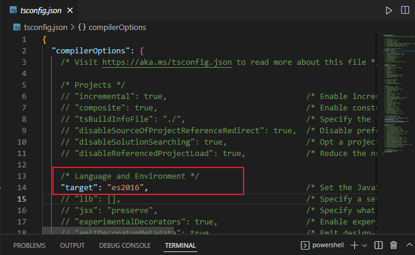
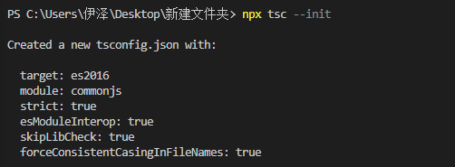
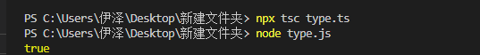
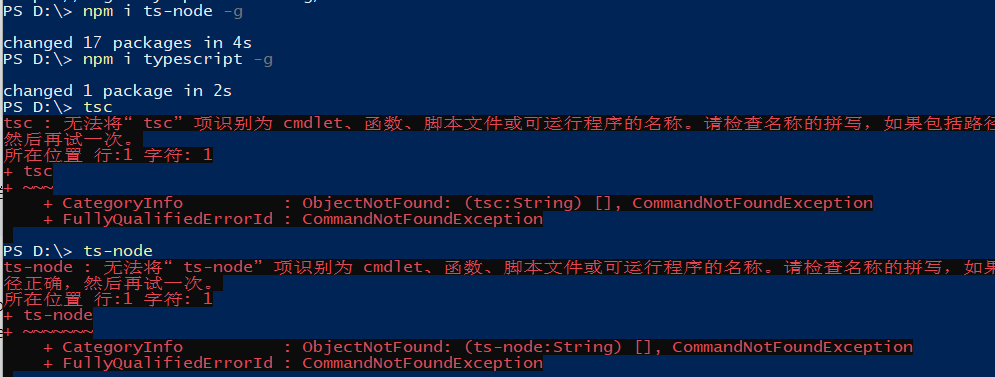

# vscode上直接运行ts

## 搭建ts工程的时候，使用tsc指令报错

**解决办法：**

### 方法1 全局安装typescrpit

使用命令 npm install typescript -g 全局安装好后就可以使用 tsc 这个命令了，缺点是： 可能会污染全局的变量，不会实时更新typescript 这个库， 毕竟安装好了一般都是不管的。

### 方法2 使用node 提供的npx

这个方法的前提是需要安装node, 有了node 的基础上才可以使用npx ， 使用方式 如下： npx tsc xxx 例如： npx tsc --init 初始化tsconfig.json 来修改配置typescript的配置

```JS
enum Days {Sun, Mon, Tue, Wed, Thu, Fri, Sat};
console.log(Days["Sun"] === 0);
```

```JS
npx tsc type.ts // 编译ts文件
node type.js	// node运行
true
```







## TSC指令错误的结局

安装

```JS
Locally in your project.

npm install -D typescript
npm install -D ts-node

Or globally with TypeScript.

npm install -g typescript
npm install -g ts-node

Depending on configuration, you may also need these

npm install -D tslib @types/node
```

```
// 还是报错
ts-node  type.ts
ts-node : 无法将“ts-node”项识别为 cmdlet、函数、脚本文件或可运行程序的名称。请检查名称的拼写，
如果包括路径，请确保路径正确，然后再试一次。
```



Tip: Installing modules locally allows you to control and share the versions through package.json. TS Node will always resolve the compiler from cwd before checking relative to its own installation.

命令行使用：
```powershell
Execute a script as `node` + `tsc`.

ts-node script.ts

Starts a TypeScript REPL.

ts-node

Execute code with TypeScript.

ts-node -e 'console.log("Hello, world!")'

Execute, and print, code with TypeScript.

ts-node -p -e '"Hello, world!"'

Pipe scripts to execute with TypeScript.

echo 'console.log("Hello, world!")' | ts-node

Equivalent to ts-node --transpile-only

ts-node-transpile-only script.ts

Equivalent to ts-node --cwd-mode

ts-node-cwd script.ts
```


